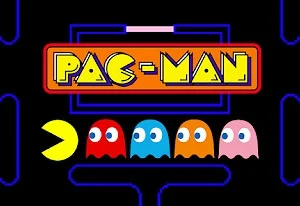
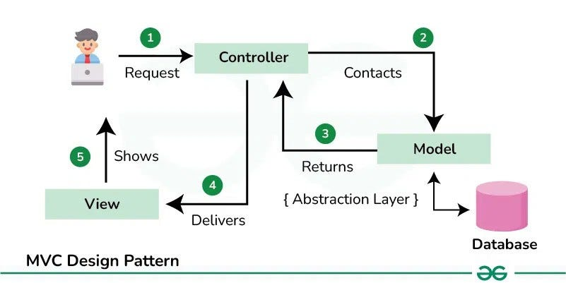

# PacMan-POO
# 🕹️ Proyecto Pac-Man en JavaFX
<div align="center">


Este proyecto es una recreación del clásico juego **Pac-Man**, desarrollada en **Java** utilizando el framework gráfico **JavaFX**. El objetivo principal es aplicar conceptos de programación orientada a objetos (POO), arquitectura Modelo-Vista-Controlador (MVC) y manejo de bucles de juego (game loops).
</div>


## 🚀 Características Técnicas

* **Arquitectura MVC:** Separación clara entre la lógica del juego (`Controlador`), la visualización (`Vista`) y el modelo de datos.
* **Game Loop Robusto:** Implementación de un `AnimationTimer` optimizado.
* **Sincronización:** Uso de un factor de conversión (`* 1_000_000`) para alinear la lógica (milisegundos) con el reloj del sistema (nanosegundos).
* **Renderizado por Capas:** Dibujado eficiente en `Canvas` utilizando un sistema de capas para objetos y personajes.

---
## 🏗️ Arquitectura
El proyecto sigue el patrón **MVC**, lo que permite escalar el juego sin que el código se vuelva un caos:



<div align="center">

* **Modelo:** Gestiona el estado lógico, coordenadas de la matriz y reglas del juego.
* **Vista:** Maneja exclusivamente el `Canvas` de JavaFX. Convierte datos en píxeles.
* **Controlador:** Orquesta la comunicación entre el modelo y la vista, y gestiona el `AnimationTimer`.

---

## 📁 Estructura del Proyecto

```text
src/
├── Controlador/       # Lógica del juego, colisiones y gestión de estados
├── Vista/             # Renderizado en Canvas, gestión de imágenes y UI
├── Modelo/            # Entidades (Pac-Man, Fantasmas, Pellets, Laberinto)
└── PAC_MAN.java       # Punto de entrada principal (Main)
